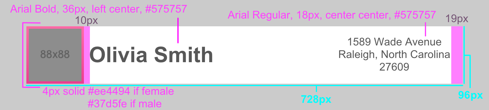
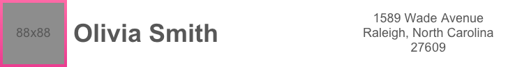

# Assignment: Create a User Profile Page

Your task is not too different from the kind of work we do putting together a hybrid application for one of our clients. Your assignment is to begin building a user profile.

Available to you is a design specification that describes the layout of the user interface.  You will need to create a mock server that provides a RESTful API for retrieving the necessary data. 

You should work from the specification below to produce a finished product that is illustrated by the example below. 

**It is now up to you to create the solution!**






If you access `http://{mock server address}/api/testUser/5733a7337e3d61136595a0c9` you will see a response like:
```
{  
   "person":{  
      "address":{  
         "street-number":"1312",
         "street-name":"Millbrook Road",
         "city":"Raleigh",
         "state":"North Carolina",
         "zip":"27608",
         "unit-number":null
      },
      "gender":"female",
      "given-name":"Teresa",
      "family-name":"Lewis",
      "imageURL":"/assets/img/female3.png"
   }
}
```
*To complete your work, you should use the placeholder imageURL in the JSON response.  This file is included with this project.*

# Submission Guidelines
## The rules are simple:
  * Use whatever tools and libraries you want
  * We prioritize readability and maintainability over performance, terseness, or time to implement

## Please archive and upload your files to a cloud storage provider (e.g. Google Drive) and share them with us once you have completed your project.
